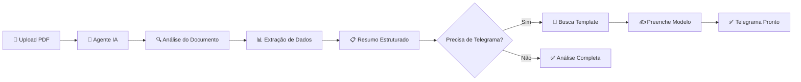
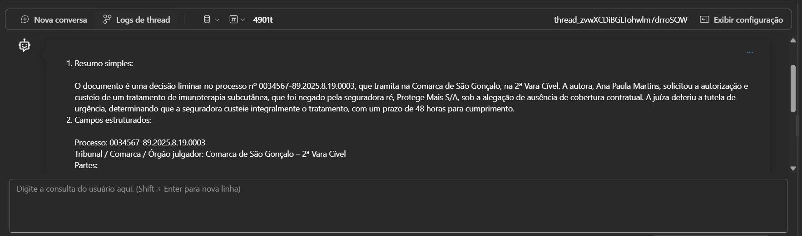
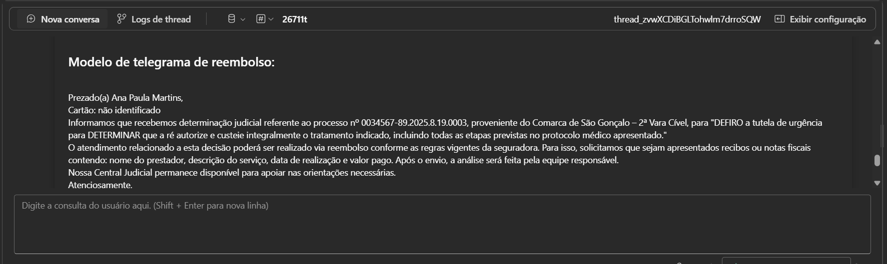

# 🤖 Agente Jurídico Operacional - Azure AI

> Automatização inteligente para análise de decisões judiciais e preenchimento de telegramas

[](https://ai.azure.com)
[](https://github.com/seu-usuario/seu-repositorio)

---

## 📋 Índice

- [Sobre o Projeto](#-sobre-o-projeto)
- [Funcionalidades](#-funcionalidades)
- [Como Funciona](#-como-funciona)
- [Demonstração](#-demonstração)
- [Tecnologias Utilizadas](#-tecnologias-utilizadas)
- [Como Usar](#-como-usar)
- [Estrutura do Agente](#-estrutura-do-agente)
- [Exemplos de Uso](#-exemplos-de-uso)
- [Referências](#-referências)
- [Autor](#-autor)

---

## 🎯 Sobre o Projeto

O **Agente Jurídico Operacional** é uma solução de IA desenvolvida no Azure AI Foundry que automatiza a leitura e interpretação de documentos judiciais, extraindo informações específicas e preenchendo automaticamente modelos de telegrama.

### 💡 Origem do Projeto

Este projeto foi originado a partir da identificação de uma **dor real** no setor jurídico operacional. Durante minha vivência na área, observei que profissionais dedicam horas diárias realizando tarefas repetitivas:

- 📄 Leitura manual de dezenas de decisões judiciais
- ✍️ Extração manual de informações-chave de documentos extensos
- 📋 Preenchimento de telegramas com dados extraídos
- ⏰ Alto consumo de tempo em atividades de baixo valor agregado
- 😓 Risco elevado de erro humano por fadiga e volume de trabalho

### 🎯 Propósito

Desenvolver uma solução tecnológica que:
- **Libere tempo** para atividades que demandam análises mais complexas
- **Reduza erros** operacionais por automação
- **Aumente produtividade** sem aumentar custos ou equipe

### ✅ Solução

Com este agente de IA:
- ✅ **Análise automática** de documentos jurídicos (liminar, sentença, acórdão etc)
- ✅ **Extração inteligente** de informações-chave
- ✅ **Preenchimento automático** de telegramas padronizados
- ✅ **Redução do tempo** de processamento

---

## ⚙️ Funcionalidades

### 📄 Análise de Documentos Judiciais

O agente processa os seguintes tipos de documentos:
- Sentenças
- Liminares
- Acórdãos
- Agravos de Instrumento

### 🔍 Extração Automática de Dados

Extrai automaticamente:
- 📋 Número do processo
- ⚖️ Tribunal/Comarca/Órgão julgador
- 👥 Partes (autor e réu)
- ✅ Tipo de decisão (deferida/indeferida/parcial)
- 📝 Contexto da ação
- 📜 Deferimento literal (texto exato da decisão)
- ⏰ Prazos e datas

### 📨 Preenchimento Inteligente de Telegramas

- Utiliza templates armazenados na Knowledge Base
- Preenche automaticamente campos variáveis
- Mantém formatação oficial dos documentos
- Garante conformidade com padrões estabelecidos

---

## 🔄 Como Funciona



### Fluxo Detalhado

1. **📤 Upload**: Usuário anexa documento judicial (PDF)
2. **🔍 Validação**: Agente verifica se é documento judicial válido
3. **📖 Leitura**: IA processa o texto do documento
4. **🎯 Extração**: Identifica e extrai informações estruturadas
5. **📝 Resumo**: Gera resumo objetivo em linguagem simples
6. **📨 Telegrama**: (Opcional) Preenche template da Knowledge Base
7. **✅ Entrega**: Apresenta resultado formatado

---

## 🎬 Demonstração

### Exemplo 1: Análise de Liminar

**Entrada:**
```
📎 liminar_fictícia.pdf (anexado)
"Analise este documento"
```

**Saída do Agente:**



```
Resumo simples:

O documento é uma decisão liminar no processo nº 0034567-89.2025.8.19.0003, que tramita na Comarca de São Gonçalo, na 2ª Vara Cível. A autora, Ana Paula Martins, solicitou a autorização e custeio de um tratamento de imunoterapia subcutânea, que foi negado pela seguradora ré, Protege Mais S/A, sob a alegação de ausência de cobertura contratual. A juíza deferiu a tutela de urgência, determinando que a seguradora custeie integralmente o tratamento, com um prazo de 48 horas para cumprimento.
Campos estruturados:

Processo: 0034567-89.2025.8.19.0003
Tribunal / Comarca / Órgão julgador: Comarca de São Gonçalo – 2ª Vara Cível
Partes:
• Autor: Ana Paula Martins
• Réu: Seguradora Protege Mais S/A
Tipo da decisão: deferida
Contexto geral: A autora solicitou a autorização e custeio de tratamento de imunoterapia subcutânea, negado pela seguradora por falta de cobertura contratual.
Deferimento na íntegra: "DEFIRO a tutela de urgência para DETERMINAR que a ré autorize e custeie integralmente o tratamento indicado, incluindo todas as etapas previstas no protocolo médico apresentado."
Prazo: 48 horas
Data de início: não identificado

```

---

### Exemplo 2: Preenchimento de Telegrama

**Entrada:**
```
"Preencha o telegrama de reembolso"
```

**Saída do Agente:**



```
Confirmo o modelo de telegrama de reembolso. Vou preenchê-lo com as informações extraídas do documento.  
   
Modelo de telegrama de reembolso:  
   
---  
   
Prezado(a) Ana Paula Martins,    
Cartão: não identificado    
Informamos que recebemos determinação judicial referente ao processo nº 0034567-89.2025.8.19.0003, proveniente do Comarca de São Gonçalo – 2ª Vara Cível, para "DEFIRO a tutela de urgência para DETERMINAR que a ré autorize e custeie integralmente o tratamento indicado, incluindo todas as etapas previstas no protocolo médico apresentado."    
O atendimento relacionado a esta decisão poderá ser realizado via reembolso conforme as regras vigentes da seguradora. Para isso, solicitamos que sejam apresentados recibos ou notas fiscais contendo: nome do prestador, descrição do serviço, data de realização e valor pago. Após o envio, a análise será feita pela equipe responsável.    
Nossa Central Judicial permanece disponível para apoiar nas orientações necessárias.    
Atenciosamente,    
Setor de Liminares Judiciais – Saúde    
Seguradora de Saúde    
  
---  
   
Aqui está o telegrama de reembolso pronto para revisão. Se precisar de ajustes, por favor, me avise!

```

---

## 🛠️ Tecnologias Utilizadas

### Azure AI Foundry
Plataforma principal para criação e gerenciamento do agente de IA

**Recursos utilizados:**
- 🤖 **Agent Builder** - Configuração do agente
- 📚 **Knowledge Base** - Armazenamento de templates
- 💬 **Chat Interface** - Interface de interação
- 📄 **Document Processing** - Processamento de PDFs

### Modelo de IA
- **GPT-4o-mini** (configurável no Foundry)

### Formato de Documentos
- **Entrada**: PDF (documentos judiciais)
- **Saída**: Texto estruturado + Markdown

---

## 🚀 Como Usar

### Pré-requisitos

- ✅ Conta Azure ativa ([criar conta gratuita](https://azure.microsoft.com/free/))
- ✅ Acesso ao Azure AI Foundry ([acessar aqui](https://ai.azure.com))
- ✅ Grupo de recursos criado no AI Foundry ([acessar aqui](https://learn.microsoft.com/azure/azure-resource-manager/management/manage-resource-groups-portal#create-resource-groups))

### Passo 1: Criar o Agente no Azure AI Foundry

1. **Acesse o Azure AI Foundry**
   - Entre em: https://ai.azure.com
   - Faça login com sua conta Microsoft

2. **Crie um novo Projeto**
   ```
   → Clique em "Criar"
   → Nome: "azure-girls-project"
   → Região: eastus (de acordo com a necessidade de agente)
   → Confirmar criação
   ```
3. **Faça Deploy de um modelo LLM**
   ```
   → No menu lateral: "Catálogo de Modelos"
   → Selecione o modelo de preferência (neste agente utilizamos o gpt-4o-mini)
   → Nome: "legal-assistant-gpt-4o-mini"

4. **Crie o Agente**
   ```
   → No menu lateral: "Agentes"
   → Clique em "Novo Agente"
   → Nome: "Agent-Legal-Assistant"
   → Modelo: GPT-4o-mini
   ```

### Passo 2: Configurar o System Prompt

1. Na seção **"Configuração"**
2. Cole nas intruções o prompt completo disponível em: [`/prompts/prompt-do-agente.md`](agente-juridico-azure/prompts/prompt-do-agente.md)

### Passo 3: Adicionar Knowledge Base

1. No menu do agente, clique em **"Conhecimento"**
2. Clique em **"Adicionar"** → **"Adicionar fonte de dados"**
3. Faça upload dos templates de telegrama (pasta `/templates/`)
4. Aguarde a indexação completar
5. Nomeie como: **"Telegramas"**

### Passo 4: Testar o Agente

1. Na opção **"Abrir no Playground"**, clique no ícone de anexo 📎
2. Faça upload de um documento judicial (PDF)
3. Digite: **"Analise este documento"**
4. Aguarde a resposta estruturada
5. (Opcional) Solicite: **"Preencha o telegrama padrão"**

### ✅ Pronto! Seu agente está funcionando!

---

## 📁 Estrutura do Agente

```
agente-juridico-azure/
│
├── 📄 README.md                    # Este arquivo
│
├── 📂 prompts/
│   └── prompt-do-agente.md            # Prompt completo do agente
│
├── 📂 templates/
│   ├── TELEGRAMA_INDICACAO.txt
│   ├── TELEGRAMA_REEMBOLSO.txt
│   ├── TELEGRAMA_PADRAO.txt
││
├── 📂 prints/
│   ├── analise_liminar.png         # Screenshot de análise
│   ├── telegrama_preenchido.png    # Screenshot de telegrama
│   ├── interface_foundry.png       # Interface do Foundry
│   └── knowledge_base.png          # Configuração da KB
│
├── 📂 exemplos/
│   ├── agravo-ficticio.pdf         # (Documento fictício)
│   └── liminar-ficticia.pdf        # (Documento fictício)
│
└── 📂 docs/
    ├── guia-rapido.md              # Guia de uso rápido
    └── troubleshooting.md          # Solução de problemas
```

---

## 💼 Exemplos de Uso

### Caso de Uso 1: Setor Operacional

**Cenário:** Chegam 20 decisões judiciais por dia que precisam ser processadas

**Antes:**
- ⏱️ 15 minutos por documento
- ⏱️ 5 horas de trabalho/dia

**Depois:**
- ⏱️ 1 minuto por documento (IA)
- ⏱️ 20 minutos de trabalho/dia
- 🎉 **Economia de 4h40min por dia!**

### Caso de Uso 2: Preparação de Comunicações

**Cenário:** Envio de telegramas após decisões judiciais

**Processo automatizado:**
1. Upload da decisão → 2. Análise automática → 3. Telegrama pronto

**Resultado:**
- ✅ Zero erros de digitação
- ✅ Padronização total
- ✅ Rastreabilidade completa

---

## 📚 Referências

### Documentação Oficial

- 📘 [Azure AI Foundry - Documentação](https://learn.microsoft.com/azure/ai-studio/)

### Tutoriais Utilizados

- 🎥 [Como usar o Playground no Azure AI Foundry](https://learn.microsoft.com/azure/ai-studio/quickstarts/get-started-playground)
- 🎥 [Configuração do Agente](https://learn.microsoft.com/pt-br/azure/ai-foundry/agents/concepts/standard-agent-setup?view=foundry-classic)

### Referência

- 📄 [IA Generativa no Setor Jurídico](https://www.thomsonreuters.com.br/pt/juridico/blog/ia-generativa-pratica-juridica.html)

---

## 👨‍💻 Autor

**Natacha de Andrade**

Este trabalho representa a convergência entre experiência prática no setor jurídico operacional e interesse em tecnologia e inovação. A vivência com os desafios da área me permitiu identificar oportunidades reais de aplicação de IA para realizar melhorias que podem impactar positivamente a produtividade da equipe.

- 📧 Email: natacha.ruffo@gmail.com
- 💼 LinkedIn: [linkedin.com/in/natacha-andrade/](https://www.linkedin.com/in/natacha-andrade/)
- 🐙 GitHub: [@natuffa](https://github.com/natuffa)

---

## 🙏 Agradecimentos

- Comunidade do Azure Frontier Girls
- Equipe de professores da Microsoft e da WoMakers Code

---

<div align="center">

### ⭐ Se este projeto foi útil, deixe uma estrela!

**Desenvolvido com ❤️ usando Azure AI Foundry**

</div>
